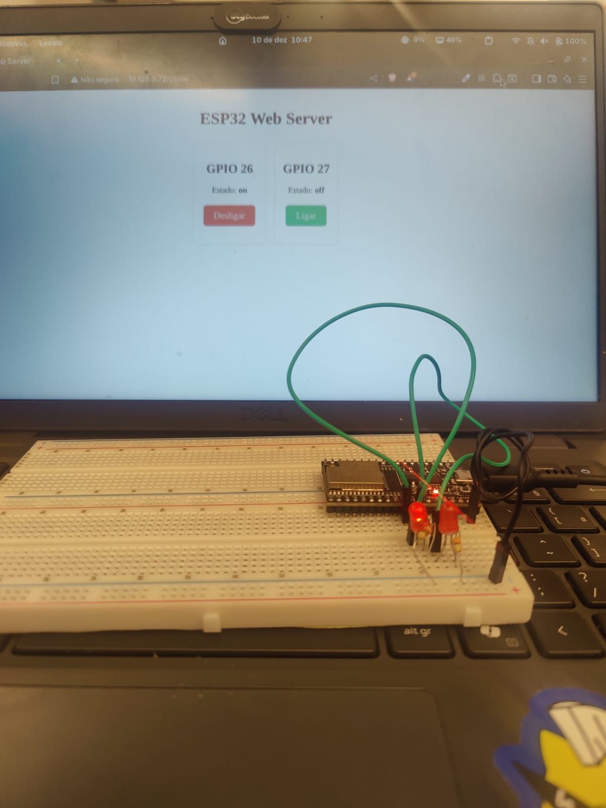
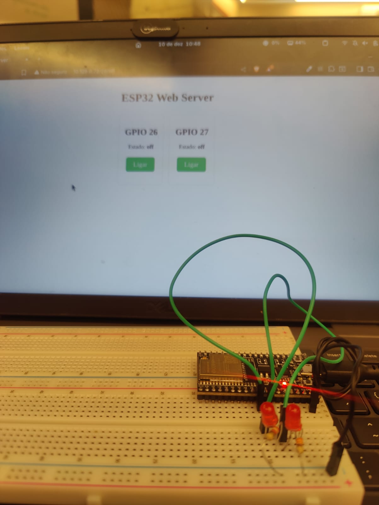
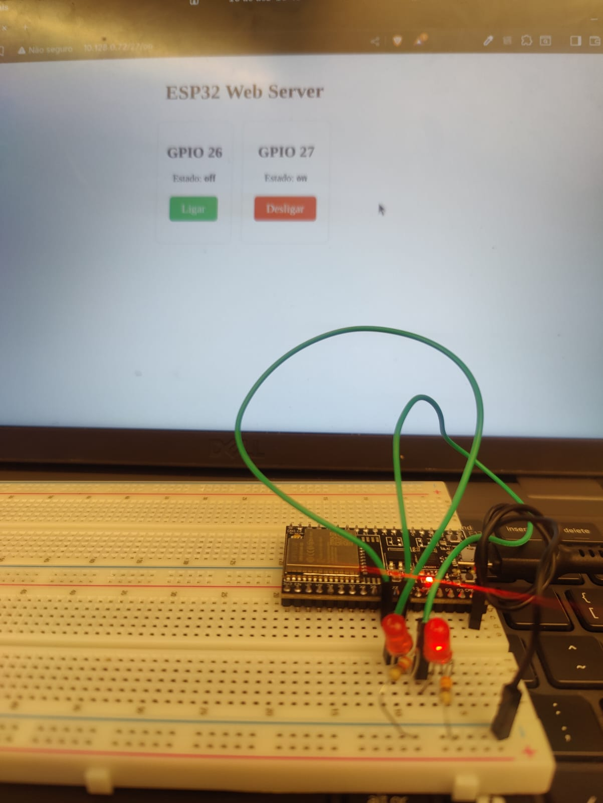

# Relatório Técnico - Pentest em Solução IoT com ESP32

## 1. Integrantes
- Amanda Critina Martinez da Rosa
- Lívia de Souza Negrini
- Kaian Santos Moura
- Pedro Damacena Machado Uchoa 
- Leonardo Nicoli Lameda
- Luiz Gustavo Borges Oliveira

## 2. Introdução

&emsp;Este documento apresenta os resultados de uma análise de segurança (pentest) realizada sobre um servidor web local implementado em um ESP32. O objetivo desse estudo é identificar vulnerabilidades existentes, demonstrar possíveis ataques explorando essas falhas e avaliar o risco associado a cada cenário, considerando probabilidade, impacto e justificativas técnicas.

&emsp;Durante o processo, foram analisados o código-fonte do servidor web, seus endpoints, a forma como o ESP32 se conecta à rede e a maneira como a comunicação ocorre. Também foi executado um estudo prático (opcional) para validação dinâmica de um dos ataques.

## 3. Análise Estática do Código

&emsp;Durante a leitura e interpretação do código fornecido pelo tutorial oficial, foram encontradas as seguintes vulnerabilidades:

### Vulnerabilidade 1 - Credenciais expostas no código

&emsp;O SSID e a senha da rede Wi-Fi ficam armazenados diretamente no código-fonte, sem criptografia ou proteção.
Isso significa que qualquer pessoa com acesso ao firmware pode extrair essas credenciais.

### Vulnerabilidade 2 - Falta de autenticação no servidor web

&emsp;Qualquer usuário conectado à mesma rede pode acessar o IP do ESP32 e controlar o dispositivo sem qualquer tipo de validação, login ou autorização.

### Vulnerabilidade 3 - Comunicação sem criptografia (HTTP puro)

Todas as requisições e respostas trafegam em texto aberto.
Esse ponto permite ataques de interceptação e inspeção de pacotes.

### Vulnerabilidade 4 - Endpoints expostos sem validação

Os endpoints /on, /off, /status e similares respondem a qualquer requisição, sem checagem de origem ou limite de acesso.

### Vulnerabilidade 5 - Suscetibilidade a DoS (negação de serviço)

O ESP32 pode travar ou reiniciar quando recebe um volume excessivo de requisições.

(Espaço para acrescentar vulnerabilidades específicas que você mesma encontrou durante a análise do seu grupo)
→ [ADICIONAR AQUI]

## 4. Ataques Identificados

[Planilhas](https://docs.google.com/spreadsheets/d/1z1czDqkwxRY4-wi6U1gx47EGtI26L0anEBhk2fmlzCM/edit?gid=0#gid=0)

&emsp;A seguir estão descritos dois ataques distintos, completos, didáticos e prontos para o relatório.

### Ataque 1 - DDos
#### Descrição resumida
(...)

#### Passo a passo do ataque

O atacante escaneia a rede local para encontrar o IP do ESP32.

Ele acessa o endereço pelo navegador:

http://[IP_DO_ESP32]

Ele descobre que existem endpoints como /on e /off.

Ele executa comandos manualmente ou cria scripts para automatizar requisições.

O ESP32 executa todos os comandos, pois não há proteção.

#### Probabilidade

Alta — basta estar conectado na mesma rede.

#### Impacto

Médio a Alto, dependendo do que o dispositivo controla.

#### Risco resultante

Alto, devido à combinação de alta probabilidade + impacto significativo.

(Espaço para você adicionar prints, evidências ou observações do grupo)
→ [ADICIONAR AQUI]

### Ataque 2 — Interceptação de tráfego (MITM / Sniffing)

(...)

## 5. Tabela Consolidada dos Ataques

(adicionar tabela)

(Espaço para a tabela final da TURMA, conforme solicitado pelo barema)
→ [ADICIONAR AQUI A TABELA CONSOLIDADA FINAL]

## 6. Análise Dinâmica — Teste Real em Protoboard

&emsp;Aqui encontra-se as imagens que comprovam o WEB Server funcionam, seguidas do IP:

#### Figura 1 - Led 1 Ligado e Led 2 Desligado

  
 Fonte: Elaborado pelos autores (2025)

--- 

#### Figura 2 - Ambos os Leds Ligados

 
 Fonte: Elaborado pelos autores (2025)

--- 

#### Figura 3 - Led 1 Desligado e Led 2 Ligado

 
 Fonte: Elaborado pelos autores (2025)

## 7. Conclusão

&emsp;A análise demonstrou que o servidor web em ESP32, apesar de funcional e didático, apresenta diversas vulnerabilidades críticas que podem ser exploradas com facilidade dentro de uma rede local. Vulnerabilidades como falta de autenticação, comunicação sem criptografia e exposição de endpoints sem controle permitem ataques que variam desde simples manipulação indevida até interceptação de tráfego.

&emsp;As análises desenvolvidas reforçam a importância de incorporar práticas básicas de segurança em dispositivos IoT, como autenticação, criptografia (TLS/HTTPS), sanitização adequada de entradas, segregação de redes e revisão do firmware.
